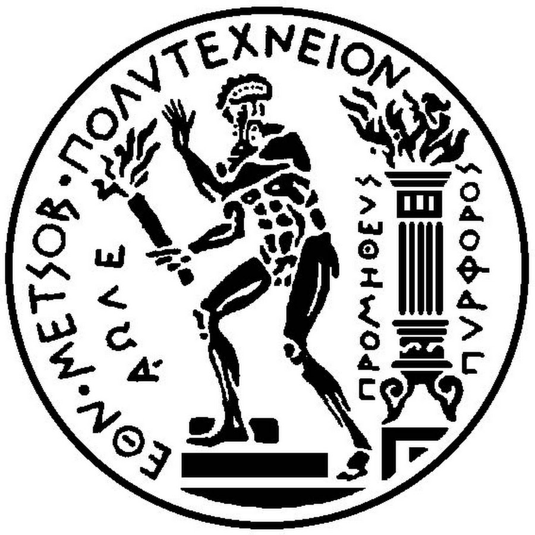

National Technical University of Athens 
School of Mechanical Engineering 
Section of Mechanical Design and Automatic Control 
Control Systems Laboratory 

 

### Design and Development of SLAM Algorithms

Nikolaos Koukis 
Master Thesis Presentation

<!--TODO Add a date -->
<!--TODO Add current section in right/left footer-->
<!--TODO Make this an offline version-->
<!--TODO Test presenter mode-->

TODO

---

### Presentation Contents

- Intro - What is SLAM? |
- SLAM Algorithms - Why choose graphSLAM? |
- Single-Robot graphSLAM |
- Multi-Robot graphSLAM |
- Conclusions - Future Directions |

---

## Intro - What is SLAM?

TODO

---

### Definition

TODO

---

### SLAM Commercial/Academic Usages

TODO

---

<!--- --------- End of Intro - What is SLAM?-->

## SLAM Algorithms - Why Choose graphSLAM?

TODO

---

### Map Representation

- Feature-based SLAM |
- View-based SLAM |
- ...

TODO

Note:
describe **briefly** the two variants
~2min

---

### Processing Scheme

- Kalman Filter (KF) |
- Particle-Filtering (PF) |
- Graph-based approaches |

TODO

Note:
describe **briefly** the KF, PF. GraphSLAM is on its own in the next
~2min

---

<!--- --------- End of SLAM Algorithms - Why choose graphSLAM?-->

## Single-Robot graphSLAM

- Goals |
- Mathematical Formulation |
- Simulations |
- Real-time Experiments |

TODO

---

#### Development Goals

- Generic/Extensible design
  - Handle odometry, laser scans, monocular/stero images etc. |
  - 2D/3D SLAM |
- Offline/online use
  - Offline use with simulated or prerecorded datasets |
  - Integration with ROS for real-time graphSLAM |

Note:
How much am I going to write here?
Why exactly did I implement these things?
This should provide the **end product** of your work in sr-graphSLAM so that,
when you show them the specific math steps below, to know what they are about!

---

### Levenberg-Marquardt Least-Squares Optimization

TODO

---

### Iterative Closest Point - ICP

TODO

---

### Robust Loop-Closure (LC) Scheme

TODO

---

### MRPT Simulation Examples

---?image=assets/figures/gimp/mrpt_sr_slam_combined.png&size=contain

<!--TODO Build this.-->
---?image=assets/figures/gimp/mrpt_sr_slam_combined2.png

<!--- --------- End of Single-Robot graphSLAM-->

## Inter-Robot Communication

TODO

<!--- --------- End of Inter-Robot Communication-->

## Multi-Robot graphSLAM

TODO

---

### Multi-hypothesis Map-matching

TODO

### Simulation Results

TODO

---

### Experimental Results

TODO

---

<!--- --------- End of Multi-Robot graphSLAM-->

## Conclusions - Future Directions

TODO

---

<!--- --------- End of Conclusions - Future Directions-->
